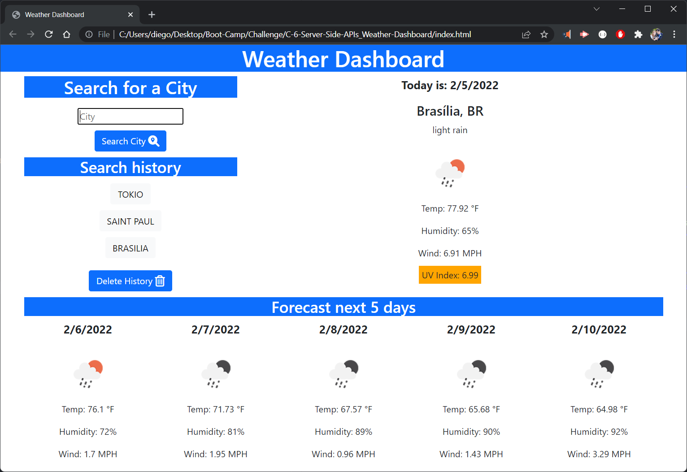
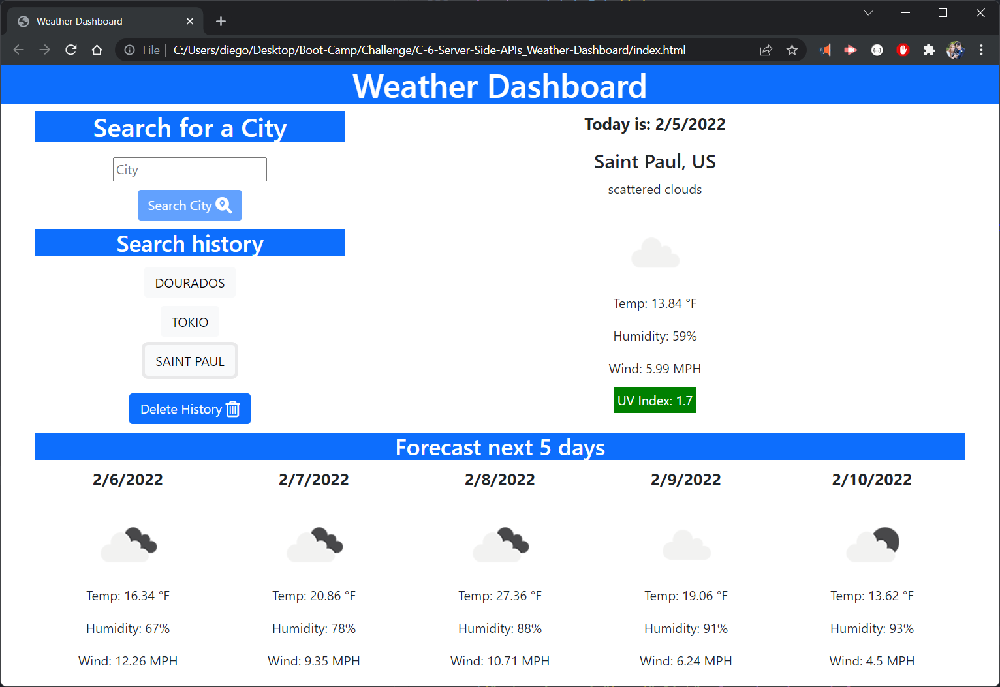

# 06 Server-Side APIs: Weather Dashboard

Use the [OpenWeather One Call API](https://openweathermap.org/api/one-call-api) to retrieve weather data.

## Targeted Goals:

```
- Build a basic weather dashboard using 'OpenWeather One Call API'
- User can search a city and see current and future 5 days of forecast
- Use 'localStorage' to store persistent data
- Build a history list
- Current weather display: city name, date, icon representation, temperature,
  humidity, wind speed, and UV index
- Add color indication for UV index
- 5 days forecast display: temperature, wind speed, and humidity
- Make the history list clickable and show the city again after click
```

## Application deployed at URL:

https://kakudiego.github.io/C-6-Server-Side-APIs_Weather-Dashboard/

## GitHub repository:

https://github.com/kakudiego/C-6-Server-Side-APIs_Weather-Dashboard

The following image demonstrates the application functionality:






